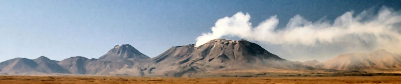

# About Varis (Volcanoms)

**Volcanic Anomalies Monitoring System** (VARIS) is a volcanic thermal anomalies detection system based on the analysis of Land Remote Sensing Satellite (Landsat) TM (Thematic Mapper), ETM+ (Enhanced Thematic Mapper Plus) and OLI (Operational Land Imager) images.

Landsat images technical properties can be accessed from the official website http://landsat.usgs.gov/

Our code is based in the Dual Band Method (Rothery et al 1988), Three Band and Three Components Method (Harris et al 1999a), thermal analysis for Landsat 8 (OLI) images proposed by Blackett (2014) and improvements to Three Band and Three Components Method carried out by Gonzalez et al (2015).

- **Funding**: FIC-R Mitigación del Riesgo Asociado a procesos volcánicos en la Región de Antofagasta (BIP 30488832-0).
- **Institution**: [Universidad Católica del Norte](http://www.ucn.cl).

## Research

- [Layana S, Aguilera F, Urrutia D, Salazar P (2016) VOLCANOMS](https://www.researchgate.net/publication/311602727_VOLCANOMS_a_low_cost_and_automated_volcanic_monitoring_system_for_Chilean_volcanoes_based_on_Landsat_ETM_and_OLI_satellite_images), a low cost and automated volcanic monitoring system for Chilean volcanoes based on Landsat ETM+ and OLI satellite images. In: Cities on Volcanoes 9, Puerto Varas, Chile, 20-25 November 2016.

### References

- Blackett M (2014) Early analysis of Landsat-8 thermal infrared sensor imagery of volcanic activity. Remote Sens 6:2282-2295
- González C, Inostroza M, Aguilera F, González R, Viramonte J, Manzies A (2015) Heat and mass flux measurements using Landsat images during 2000-2004 period, Lascar volcano, northern Chile. J Volc Geotherm Res 301:277-292
- Harris A, Flynn L, Rothery D, Oppenheimer C, Sherman S (1999) Mass flux measurements at active lava lakes: Implications for magma recycling. J Geophys Res 104:7117-7136
- Rothery D, Francis P, Wood C (1988) Volcano monitoring using short wavelength infrared data from satellite. J Geophys Res 93:7993-8008

## Team

- **Susana Layana**, Geologist, PhD student in Geological Sciences, Universidad Católica del Norte, Chile.
- **Felipe Aguilera**, Geologist, PhD in Geological Sciences, Universidad Católica del Norte, Chile.
- **Germán Rojo Arce** (<garojar97@gmail.com>), Software Engineer student, Universidad Católica del Norte, Chile.
-  **[Diego Urrutia-Astorga](http://durrutia.cl)** (<durrutia@ucn.cl>), MSc in Informatics Engineering, Universidad Católica del Norte, Chile.

## Acknowledgements
Our acknowledgments to U.S. Geological Survey for provide the extent database of Landsat images.
